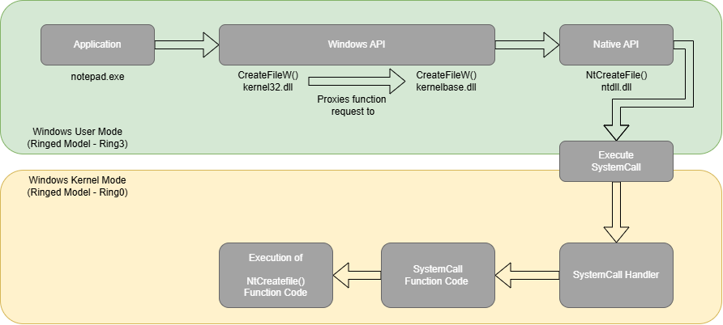

# Into the Abyss 
<br>
<center>

_**"And if you gaze long into an abyss, the abyss also gazes into you."**_
<br>Friedrich Nietzsche
</center>

<br>


## Introduction

So, it’s been quiet for a while on the blog for well … reasons. And those reasons definitely have nothing to do with a short break from studying or the game releases of Path of Exile 2 and Monster Hunter Wilds eating up most of my free time in the evenings. 😅 But I’m back now with a new blog post!<br>

I see my blog as a vehicle that primarily helps me understand topics better and learn something new. Writing these topics down helps me tremendously in the learning process—and maybe, just maybe, I can help a few others along the way.<br>

In this specific post, I’ll be talking about how my interest in Offensive Development has been reawakened. The blog was written in the context of when this all was happening. Of course, the blog itself was published a few days later.<br>

It's Friday night and I'm going through some old blogs looking for new interesting ways to avoid defenses and inspire me so i can twist those technique's a bit. On this specific night my interest peaked by a tactic used in one of the older campaign's from the threat actor BianLian. <br>

## Tactic & Techniques

The source of the above-mentioned blog can be found [here](https://redacted.com/blog/bianlian-ransomware-gang-gives-it-a-go/). The tactic that caught my attention mentioned that the threat actor “encountered a server that was configured and defended in such a way that they were unable to successfully execute their encryptor.”<br>
<br>
To get around this, they installed TightVNC, then modified a registry key to enable network access for TightVNC while in Safe Mode, and then simply rebooted the server in Safe Mode. Rebooting in Safe Mode boots the OS with bare minimum functionality and is often used to start recovery of the server. The threat actor leveraged this to disable (most of) the security controls, which then allowed them to also (partially) encrypt the server.<br>
<br>
The command they issued for this last part was:

```cmd 
"C:\Windows\system32\reg.exe" copy hklm\system\CurrentControlSet\services\tvnserver hklm\system\CurrentControlSet\control\safeboot\network\tvnserver /s /f
```
<br>

The blog didn’t mention it specifically, but the fact that they could install TightVNC, make adjustments in the `HKLM` section of the registry, and leverage `bcdedit.exe` means we can safely assume they already had privileged access to that specific server. However, one of the security controls is likely a form of tampering protection.<br>
<br>
The problem with straightforward techniques is that they are a world-famous rabbit hole into which you can tumble. In this case, that rabbit hole was filled by my sheer interest in developing my skillset in offensive development and avoiding detections. Due to my visual thinking, my mind instantly made a connection to one of my favorite novels/anime, [Made in Abyss](https://en.wikipedia.org/wiki/Made_in_Abyss). Ironically the character in Made in Abyss is also called "Reg". Henceforth, I hear something calling in the distance.<br>
<br>


## The Abyss is calling

With these kinds of techniques, it seems so obvious, right? Just create detections that monitor the use of the `reg.exe` and `bcdedit.exe` applications, create some alerts on them, et voilà! Blue Team is done. Next! But it does intrigue me a bit. It, so to say, tickles the brain: are we monitoring the use of the applications themselves or the actual events these programs generate in the logs?<br>

Armed with some time and a growing interest in offensive development and reverse engineering, I decided to jump down that rabbit hole. There was just one question to be answered:<br>

_"What if we removed the need for these programs and wrote a small program that is able to execute the same tasks directly through the Windows API?"_
<br>

Let’s turn something so trivial into a learning opportunity on a Friday night with some beers, music, and random Discord conversations. Before we dive in, I’ve made a small diagram showing how typical applications interact with the system. As an example, let’s try to map how Notepad would create a file.<br>




A good thing to be aware of is that, from this flow, only the Windows API is very well [documented](https://learn.microsoft.com/en-us/windows/win32/api/), so applications can be easily written using stable functions that don’t change and break existing applications.<br>

The Native API is a different story—it has no official documentation, but there are quite a few community efforts. Let’s divert back to our “What if” scenario and take our first minor steps toward directly communicating with the Windows API.<br>

### Replacing the `reg.exe copy` functionality

Like every application, `reg.exe` is just a user-friendly way of communicating with the Windows API. For what we want to accomplish, we only need a few of those Windows API functions to achieve our goal. We don’t need to rewrite a complete new iteration of `reg.exe` just the copy function it offers.<br><br>

We also want to avoid hardcoding every entry in the new application. I want the application to have only static values for the source key, destination key, and the registry hive where it should look up the key and copy it to its destination. It should enumerate all the subkeys and their values below the registry key and recreate the same structure and values in the destination registry key—basically making a one-to-one copy from Location A to Location B. Essentially, we want to make an application that doesn’t require arguments and can just be run to accomplish that specific task.<br><br>

Previously, I mentioned that the Windows API is very well documented. If we want to interact with the registry hives, we can find the needed functions [here](https://learn.microsoft.com/en-us/windows/win32/api/winreg/). So let’s grab a small overview of what we logically want to achieve and then gather the functions we need.<br><br>

|Handle|Description|
|:-|:-|
`RegEnumValue`|Enumerates the values for the specified open registry key. The function copies one indexed value name and data block for the key each time it is called.
`RegSetValue`|Sets the data and type of a specified value under a registry key.
`RegOpenKey`|Opens the specified registry key.
`RegCreateKey`|Creates the specified registry key. If the key already exists, the function opens it.
`RegCloseKey`|Closes a handle to the specified registry key.

<br>
So, let’s get to it (finally). Let’s start by defining the `SOURCE_KEY_PATH` and the `DEST_KEY_PATH`. Keep in mind that we should also provide some feedback during execution to indicate whether something was successful or not..<br><br>


```c
#include <windows.h>
#include <stdio.h>

#define SOURCE_KEY_PATH "System\\CurrentControlSet\\Services\\tvnserver"
#define DEST_KEY_PATH "System\\CurrentControlSet\\control\\safeboot\\network\\tvnserver"
```
<br>
Now that we’ve finally started, let’s create the copy function. This function will allow us to read the subkeys and their values and recreate them at the destination. <br><br>

```c
void CopyRegistryKey(HKEY hSourceKey, HKEY hDestKey) {
    DWORD valueIndex = 0;
    char valueName[256];
    BYTE data[1024];
    DWORD valueNameSize, dataSize, dataType;
    LONG result;

    while (TRUE) {
        valueNameSize = sizeof(valueName);
        dataSize = sizeof(data);

        result = RegEnumValue(hSourceKey, valueIndex, valueName, &valueNameSize, NULL, &dataType, data, &dataSize);
        if (result == ERROR_NO_MORE_ITEMS) break;
        if (result != ERROR_SUCCESS) {
            printf("Error enumerating values. Error: %ld\n", result);
            return;
        }

        result = RegSetValueEx(hDestKey, valueName, 0, dataType, data, dataSize);
        if (result != ERROR_SUCCESS) {
            printf("Error writing value '%s'. Error: %ld\n", valueName, result);
            return;
        }

        printf("Copied value: %s\n", valueName);
        valueIndex++;
    }

    DWORD subKeyIndex = 0;
    char subKeyName[256];
    DWORD subKeyNameSize;
    HKEY hSourceSubKey, hDestSubKey;

    while (TRUE) {
        subKeyNameSize = sizeof(subKeyName);
        result = RegEnumKeyEx(hSourceKey, subKeyIndex, subKeyName, &subKeyNameSize, NULL, NULL, NULL, NULL);
        if (result == ERROR_NO_MORE_ITEMS) break;
        if (result != ERROR_SUCCESS) {
            printf("Error enumerating subkeys. Error: %ld\n", result);
            return;
        }

        result = RegOpenKeyEx(hSourceKey, subKeyName, 0, KEY_READ, &hSourceSubKey);
        if (result != ERROR_SUCCESS) {
            printf("Error opening source subkey '%s'. Error: %ld\n", subKeyName, result);
            return;
        }

        result = RegCreateKeyEx(hDestKey, subKeyName, 0, NULL, REG_OPTION_NON_VOLATILE, KEY_WRITE, NULL, &hDestSubKey, NULL);
        if (result != ERROR_SUCCESS) {
            printf("Error creating destination subkey '%s'. Error: %ld\n", subKeyName, result);
            RegCloseKey(hSourceSubKey);
            return;
        }

        printf("Copying subkey: %s\n", subKeyName);
        CopyRegistryKey(hSourceSubKey, hDestSubKey);

        RegCloseKey(hSourceSubKey);
        RegCloseKey(hDestSubKey);
        subKeyIndex++;
    }
}
```
<br>
 And finally, we can write our main function and set some variables. Let’s start by templating this based on what we need<br><br>

 ```c
 int main() {
    HKEY hSourceKey, hDestKey;
    LONG result;
    DWORD disposition;
 
    // Position 1
    // Position 2
    // Position 3
    // Position 4

    return 0;

}
 ```
<br>

The next step we want to accomplish is to open the registry key defined at the `SOURCE_KEY_PATH`. We will leverage the `RegOpenKey` function for that.
The code below can be added to the template above, below the Position 1 comment..<br><br>

 ```c
    result = RegOpenKeyEx(HKEY_LOCAL_MACHINE, SOURCE_KEY_PATH, 0, KEY_READ, &hSourceKey);
    if (result != ERROR_SUCCESS) {
        printf("Failed to open source key. Error: %ld\n", result);
        return 1;
    }
 ```
<br>

Now that we have the `SOURCE_KEY_PATH` open, we want to create or open (if it exists) the destination defined in the `DEST_KEY_PATH`. For this, we can leverage the `RegCreateKey` function. The code below can be added to the template above, below the Position 2 comment.<br><br>

```c
    result = RegCreateKeyEx(HKEY_LOCAL_MACHINE, DEST_KEY_PATH, 0, NULL, REG_OPTION_NON_VOLATILE, KEY_WRITE, NULL, &hDestKey, &disposition);
    if (result != ERROR_SUCCESS) {
        printf("Failed to open/create destination key. Error: %ld\n", result);
        RegCloseKey(hSourceKey);
        return 1;
    }

    printf(disposition == REG_CREATED_NEW_KEY ? "Destination key created.\n" : "Destination key already exists.\n");
```
<br>
All that remains now is to invoke the copy function we created earlier. The code below can be added to the template above, below the Position 3 comment.<br><br>

```c
    printf("Starting recursive registry copy...\n");
    CopyRegistryKey(hSourceKey, hDestKey);
    printf("Registry copy completed.\n");
```
<br>
And finally, we need to close the handles we have on the registry keys. The code below can be added to the template above, below the Position 4 comment.<br><br>

```c
    RegCloseKey(hSourceKey);
    RegCloseKey(hDestKey);
```
<br>
Now that the first part of our application to execute this technique is finished, let’s try it out.<br><br>

We’ve created the `SuperDuperKey1` registry key, located at `Computer\HKEY_LOCAL_MACHINE\SYSTEM\CurrentControlSet\Services\`. Inside it, we’ve added two subkeys: `SuperDuperSubKey1` and `SuperDuperSubKey2`. Each of these subkeys contains four values: one (Default) and three custom values.
<br>


<br>

<br>

Upon execution of our application, everything under `SuperDuperKey1` should be copied to the destination:
`System\CurrentControlSet\Control\SafeBoot\Network\`.<br>

Let’s give our application a quick test.<br>


<br>

Time to take a look in the registry and make sure everything’s where it should be. <br><br>


<br>

<br>

It seems the application executed its task flawlessly — a true "first time right" execution 😇… well, anyway.<br>

Although we used different keys, we successfully replicated the technique in a custom application. This highlights the importance of monitoring actual events rather than just the execution of specific applications — or better yet, doing both.<br><br>

### Avoiding the use of  `bcdedit.exe`

In all fairness, I took some time diving into it, and it is possible to perform the second part of this technique in a separate application. However, there is no pure Win32 API for modifying BCD entries — the official and programmatic route is through WMI + COM using the BCD WMI Provider.<br>

Basically, this requires creating a custom COM component that invokes `InitiateSystemShutdownEx`, while also leveraging the WMI classes `BcdStore` and `BcdObject`. Then, I would need to adjust the `{current}` boot entry to enable `SafeBoot` and set the value to `Network` in order to boot into Safe Mode with networking support.<br>

At this moment that is just way beyond my current skill level and I decided to skip this part.<br><br>

## Ending the night

It’s now early Saturday morning—around 4 AM—and after hours of staring deep into this rabbit hole, this abyss, I find myself a bit frustrated, stuck on the final piece. My brain has basically gone into suspended mode. Despite the sleep deprivation from a long day of work and this project, the journey has been incredibly rewarding. It definitely reignited my passion for Offensive Development and Windows System Internals, reminding me why I love exploring these seemingly obvious techniques and peeking beneath the surface.<br><br>

The takeaway? Sometimes, the real value lies not just in the end result, but in the learning process itself. Trying to transform a simple command-line operation into a custom application to achieve the same goal—while avoiding obvious detections—teaches you a tremendous amount about the system and its inner workings.<br><br>

I'm sure this will not be the last Blog about Offensive Development, since my journey has just started.<br>